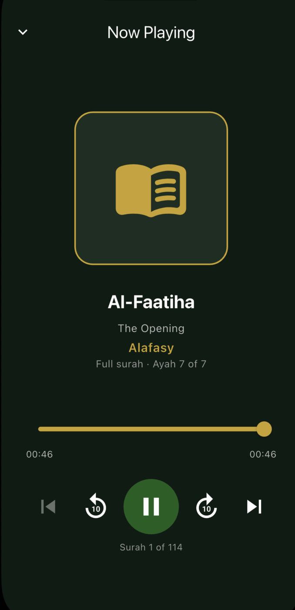
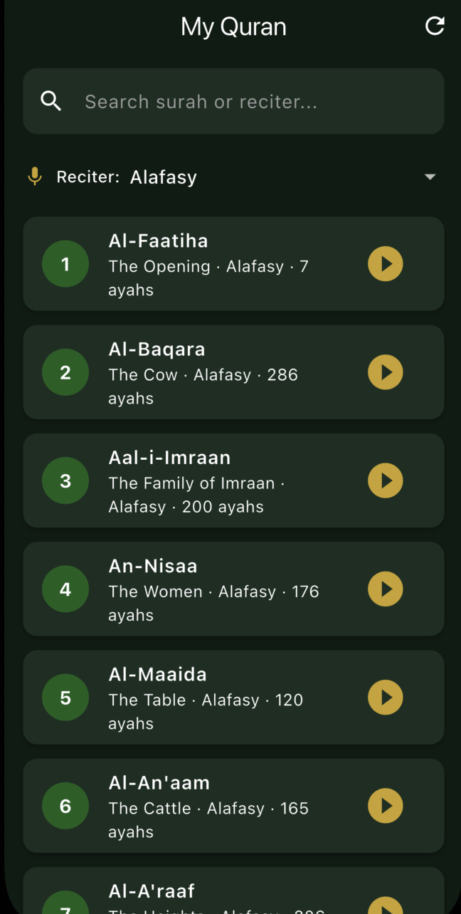

# My Quran — Audio Player

Mobile Quran audio player built for a technical assessment. Streams verse-by-verse recitations from the [Al Quran Cloud API](https://alquran.cloud/api).

## Features

| Requirement | Implementation |
|-------------|----------------|
| Search by title / artist | Search surah name, translation, or **reciter** (artist) |
| Play / Pause / Resume | `just_audio` via `AudioPlayerService` |
| Progress (current / total) | Position & duration labels + slider |
| Seek | Draggable `Slider` + ±10s skip buttons |

## Tech stack

- **Clean Architecture** — `domain` / `data` / `presentation` / `core`
- **GetX** — state management & routing (`GetMaterialApp`, controllers, `Obx`)
- **GetIt** — dependency injection (`lib/core/di/injection.dart`)
- **Dio** — HTTP client for `https://api.alquran.cloud/v1`
- **just_audio** — playback, seek, concatenated ayah sources per surah

## Project structure

```
lib/
├── core/           # DI, Dio, theme, audio service, constants
├── data/           # models, remote datasource, repository impl
├── domain/         # entities, repository contract, use cases
├── presentation/   # GetX controllers, pages, routes, widgets
└── main.dart
```

## API usage

- `GET /v1/surah` — list of 114 surahs
- `GET /v1/edition?format=audio&type=versebyverse` — reciters
- `GET /v1/surah/{number}/{reciterId}` — ayah audio URLs (e.g. `ar.alafasy`)

Documentation: https://alquran.cloud/api

## Getting started

### Prerequisites

- Flutter SDK 3.7+
- Android / iOS emulator or device

### Install & run

```bash
cd my_quran
flutter pub get
flutter run
```

### Tests

```bash
flutter test
```

### Analyze

```bash
flutter analyze
```

## Architecture notes

1. **Domain** exposes entities and use cases; no Flutter/Dio imports.
2. **Data** maps JSON to models and implements `QuranRepository`.
3. **Presentation** uses GetX controllers that call use cases only.
4. Each surah is one continuous track: ayah MP3s play via `ConcatenatingAudioSource`, while `SurahPlaybackTimeline` sums every ayah duration and maps global position/seek across the full surah (fixes per-ayah `00:06` display on iOS/Android).

## Screenshots

<p align="center">
  
  &nbsp;&nbsp;
  
</p>

<p align="center">
  <sub>Home · Player</sub>
</p>

Suggested captures:

1. Home — surah list + search + reciter dropdown  
2. Player — now playing with progress slider  
3. Mini player bar on home after returning from player  

## License

Educational / assessment project. Quran audio and text © respective contributors via [Islamic Network](https://alquran.cloud).
